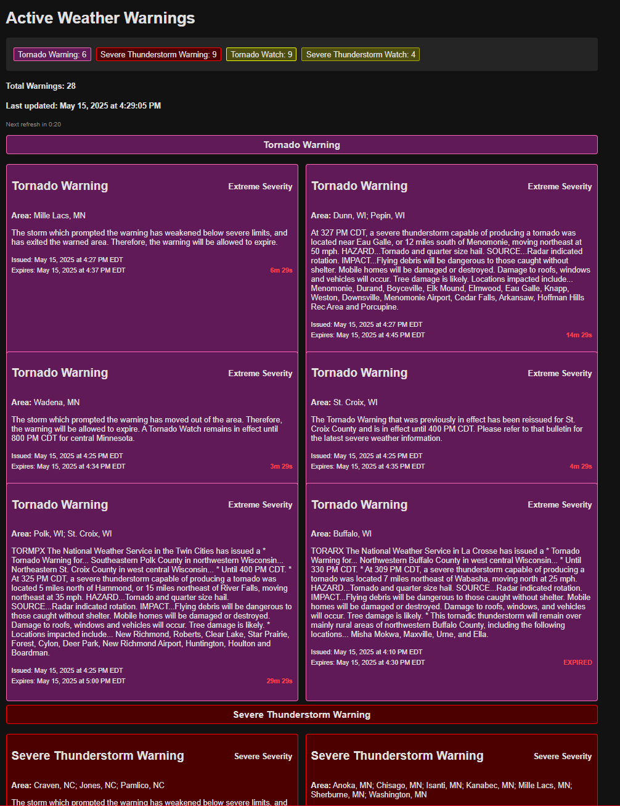

# Warnings Dashboard

A real-time weather warnings dashboard that displays active weather alerts across the United States. This application fetches, processes, and displays weather warnings in a user-friendly interface with dark mode and auto-refresh capabilities. All you need to do is run build.bat!



## Docker
- Clone the repo
- ```docker build -t weather-warnings```
- ```docker run -p 8080:8080 weather-warnings```

## Features

- **Real-time Weather Warnings**: Displays current active weather warnings from the NWS
- **Warning Type Summary**: Provides a count of each type of active warning
- **Auto-refresh**: Page automatically refreshes every 30 seconds to show the latest data
- **Dark Mode**: By default
- **Severity Indicators**: Visual indicators for different warning severity levels

## Technology Stack

- **Backend**: Go (Golang)
- **Frontend**: HTML and CSS
- **Templating**: TEMPL
- **Data Source**: NWS
